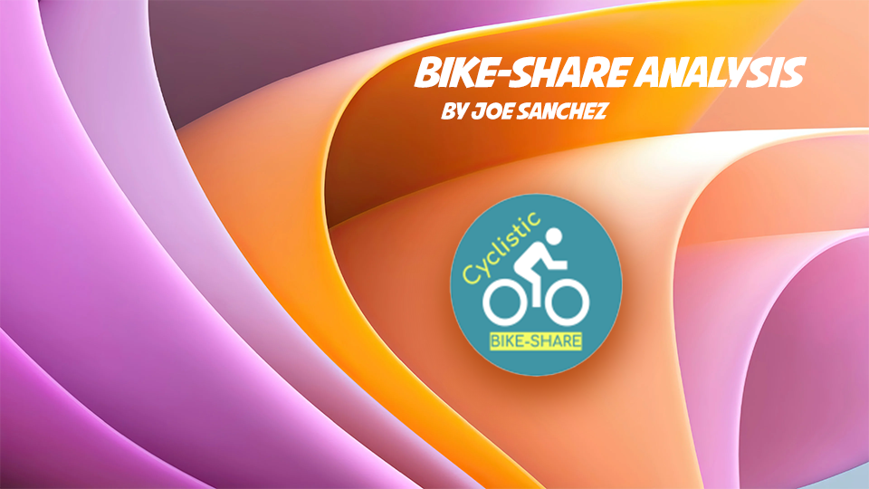

# Bike Share Membership Analysis

## Overview

For this case study, a bike-share company in Chicago by the name of Cyclistic wants to utilize the skills of the marketing analyst team by designing a new marketing strategy to convert casual riders into annual members. The director of marketing believes the company's future success depends on maximizing the number of annual memberships. Therefore, it is up to me to help the team understand how casual riders and annual members use Cyclistic bikes differently. Before we put out a new marketing strategy, Cyclistic executives must approve my recommendations, so they must be backed up with compelling data insights and professional data visualizations.

## Directory

1.  [Business Understanding](https://github.com/ayeejoeey/Bike-Share-Membership-Analysis#business-understanding)
2.  [Guided Questions](https://github.com/ayeejoeey/Bike-Share-Membership-Analysis#guided-questions)
3.  [Data Understanding & Limitations](https://github.com/ayeejoeey/Bike-Share-Membership-Analysis#data-understanding--limitations)
4.  [Analysis](https://github.com/ayeejoeey/Bike-Share-Membership-Analysis#analysis)
5.  [Conclusion](https://github.com/ayeejoeey/Bike-Share-Membership-Analysis#conclusion)
6.  [Recommendations](https://github.com/ayeejoeey/Bike-Share-Membership-Analysis#recommendations)

## Business Understanding

Until now, Cyclistic's marketing strategy relied on building general awareness and appealing to broad consumer segments. One approach that helped make these things possible was the flexibility of its pricing plans: single-ride passes, full-day passes, and annual memberships. Customers who purchase single-ride or full-day passes are referred to as casual riders. Customers who purchase annual memberships are Cyclistic members.

The director of marketing believes that maximizing the number of annual members will be key to future growth. Rather than creating a marketing campaign that targets all-new customers, she believes there is a very good chance to convert casual riders into members.

The business objective will be to design marketing strategies aimed at converting casual riders into annual members. In order to do that, however, the marketing analyst team needs to better understand how annual members and casual riders differ, why casual riders would buy a membership, and how digital media could affect their marketing tactics. The marketing director and her team are interested in analyzing the Cyclistic historical bike trip data to identify trends.

## Guided Questions

These three questions will help guide the future marketing program:

1.  How do annual members and casual riders use Cyclistic bikes differently?

2.  Why would casual riders buy Cyclistic annual membership?

3.  How can Cyclistic use digital media to influence casual riders to become members?

## Data Understanding & Limitations

All data used for this analysis comes from the company's internal historical data. The data collected reflects the previous 12 months of Cyclistic trip data prior to the start of the case study. (Note: The datasets have a different name because Cyclistic is a fictional company. For the purposes of this case study, the datasets are appropriate and will enable you to answer the business questions. The data has been made available by Motivate International Inc. under this [license](https://ride.divvybikes.com/data-license-agreement).)

Data-privacy issues prohibit me from using riders' personally identifiable information. This means that I won't be able to connect pass purchases to credit card numbers to determine if casual riders live in the Cyclistic service area or if they have purchased multiple single passes.

## Analysis

The following visualizations are static and can be further evaluated in Tableau [here](https://public.tableau.com/authoring/Rideshare-Analysis_V2/Dashboard1#1)!

The past 12 months of historical data include over 5.7 million rows. For this analysis I looked at two demographics that make up these 5.7m rows, membership riders and casual riders.

Please note that the colors assigned to each target variable refer to the priority in which we view the membership riders as opposed to the casual riders. Green refers to the priority and grey refers to the values that we need to convert.

.png)

-   There are 3.4 million membership riders and 2.3 million casual riders

My main objective is to find significant differences between these two target variables (Members and Casual).

To get an idea of what the ride activity looks like, I first looked at the volume of rides throughout the year by month, and then the volume of rides throughout the week!

Here's what it looks like for the year:

.png)

-   From this visualization we can see that the membership riders are more active throughout the year even in the winter seasons. Only one month out of the 12 you see here did membership riders have a low count of 90k rides and a high of over 400k rides in July, August, and September.

-   For casual riders, the most activity seen range from the month of May to the month of October before dropping significantly. It seems casual riders prefer the months that are not part of the winter seasons in Chicago.

To get more of an idea of why we see less activity from casual riders on some of the months, I've created a visual of the daily activity for both membership and casual riders.

.png)

-   Here is a visualization of the daily ride activity for both target variables in the month of june and july.

-   The numbers 1-7 correlate to the 7 days of the week. 1 being Sunday through 7 being Saturday.

-   This graph tells me that the casual riders seem to only prefer weekend rides as opposed to the membership riders who ride more throughout the weekdays.

-   This is also the case for the rest of the months in the year, which poses a theory that the majority of membership riders use the bikes for commuting and the majority of casual riders use the bikes for leisure on the weekends. Which may be the reason why the volume of casual riders takes a dip in the winter seasons!

To further analyze this theory, I decided to take a closer look at the hours in the day that these riders are active. Hopefully the results will allow me to answer one of the initial guiding questions, "How do annual members and casual riders use Cyclistic bikes differently?".

-   This data is a collection of all 12 months summed up and categorized into the 24 hours in a day.

-   Considering that there are about 20% more membership riders than casual riders, its safe to say both parties follow a normal distribution of ride activity throughout the day.

-   However, there is one area that caught my eye that could support my original theory.

-   In the early hours of 6am through 9am, there seems to be a big spike in activity for membership riders as opposed to casual riders.

## Conclusion

1.  To answer the first question as to how membership riders differ from casual riders, I believe that the majority of the membership riders use Cyclistic's bikes for commuting to and from work and the casual riders ride the bikes for leisure. Without survey feedback it is almost impossible to give an estimated percentage of how each party uses the Cyclistic's bikes. Given the results of the data however, reassures the theory that this is the case for membership riders and that casual riders .

2.  Why would casual riders buy Cyclistic annual membership? To answer this second question, I believe advocating for commuting using Cyclistic bikes would influence casual riders to purchase an annual membership. Currently casual riders spend more time riding only 6 months out of the year. An annual membership wouldn't make sense to buy unless riders had a reason to ride throughout the year which in this case would be, to commute for work.

3.  How can Cyclistic use digital media to influence casual riders to become members? I think if we're going in the direction of campaigning for riders to commute to work, advertising media in and around popular business centers would be my first step. Cyclistic can look into investing in digital advertising display systems to promote this campaign. Connecting with local social media influencers with large followings can be of great use as well to outreach a bigger audience.

## Recommendations

One of the ways Cyclistic markets their bikes is by offering single-ride passes and full-day passes. Without data on how often and to what extent these passes are purchased, we can potentially miss out on information that help us better understand the casual segment.

Cyclistic sets itself apart by offering a variety of other bikes like reclining bikes, hand tricycles, and cargo bikes which can help people with disabilities and/or don't know how to use a standard two-wheeled bike. We know that 8% of Cyclistic riders use the assistive options. By focusing on the quality of rides for these assisted riders, we can potentially broaden and welcome more riders and offer a special discounted price for them.

I also believe adding weather data to the analysis can provide significant information that pertains to the ride-share data for membership and casual riders. Because as we well know, riding a bike is an outdoor activity, so including weather trends can potentially support the theories on ride-share activity.

## Repository Navigation 

├──[Visuals/ ](<https://github.com/ayeejoeey/Bike-Share-Membership-Analysis/tree/main/Visuals>[)](https://github.com/njw27/SER_Capstone/tree/main/images)) \<\-\-\-\-\-\-\-\-\-\-\-\-\-\-\-\-\-\-\-\-\-\-\-\-\-\-\-\-\-\-\-\-\-\-\--Directrory of all images Used For Project \<br\>

├──[ .gitignore ](<https://github.com/ayeejoeey/Bike-Share-Membership-Analysis/blob/main/.gitignore>[)](https://github.com/njw27/SER_Capstone/blob/main/.gitignore)) \<\-\-\-\-\-\-\-\-\-\-\-\-\-\-\-\-\-\-\-\-\-\-\-\-\-\-\-\-\-\-\-\-\-- Git Ignore for Project Repo \<br\>

├──[ README.md ]([https://github.com/njw27/SER_Capstone/blob/main/README.md)](https://github.com/njw27/SER_Capstone/blob/main/README.md)) \< \-\-\-\-\-\-\-\-\-\-\-\-\-\-\-\-\-\-\-\-\-\-\-\-\-\-\-\-\-- README.md that you are currently reading \<br\>

├──[ Documentation of Thought Process ](<https://github.com/ayeejoeey/Bike-Share-Membership-Analysis/blob/main/Documenting-my-steps.Rmd>[)](https://github.com/njw27/SER_Capstone/blob/main/SER_Notebook.pdf)) \<\-\-\-\-\-\-\-\-\-\-\-\-\-\-\-\-\-\-\-\-\-\-\-- Rmd file of though process \<br\>

├──[ RStudio Project File ](<https://github.com/ayeejoeey/Bike-Share-Membership-Analysis/blob/main/R_workbook_BikeShare.Rmd>[)](https://github.com/njw27/SER_Capstone/blob/main/SER_Notebook.ipynb)) \<\-\-\-\-\-\-\-\-\-\-\-\-\-\-\-\-\-\-\-\-\-- Rstudio Case Study analysis \<br\>
